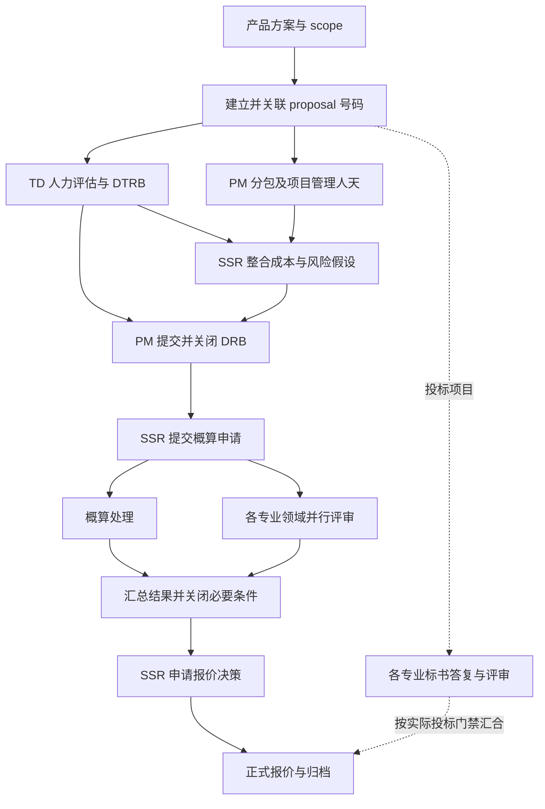

**SSR 工作平台评估与 CPQ 开发建议｜2026-09-06**

后续实施情况见 [2026-09-07 补充修复交付记录](ssr-implementation-2026-09-07.md)。下文保留实施前审查及设计依据。

结论：继续采用“自建个人工作台 + Skill”合理。现有计算、版本、持久化和导出代码值得保留，但平台尚未完整满足真实 SSR 流程。下一步应优先打通 Excel 输入输出、正式评审结果跟踪与 CPQ 数量计算，再扩展历史检索和投标协作。

本报告依据当前工作树代码、实际 CLI、测试和官方公开资料。工作区已有未提交改动，均作为当前版本审计；本轮仅新增本报告，没有改动应用功能。未验证公司系统接口、实际公司模板或真实 CPQ 目录，也未进行浏览器视觉验收。以下标为“建议”的模型与命令尚未实现。

已按用户后续澄清修订 CPQ 范围：公司 CPQ 是既有配置平台；自建平台维护编码、scope 和成本目录，按 TD 描述推荐条目，经用户确认后锁定设备数量、计算可调服务数量，并与成本版本共同归档。该闭环不以接通公司 CPQ 接口为前提。

进一步澄清：TD 通常只有大概描述，也可由 SSR 直接向 Skill 提供简短 scope。采用“简短描述 → 候选条目 → 用户筛选确认 → Skill 分析 qty”的半自动流程，不要求 TD 提供详细工作包或逐 scope 成本。

**一、现有平台满足到什么程度**

| SSR 需求                                     | 当前实现                                                    | 判定与差距                                                                                |
| -------------------------------------------- | ----------------------------------------------------------- | ----------------------------------------------------------------------------------------- |
| TD 人天、PM 管理人天和分包成本输入           | 成本网格、人天费率、分包金额已实现                          | 部分满足。成本页 Excel Import 按钮仅显示待实现提示；没有完整的 TD/PM Excel 导入映射       |
| 整合成本                                     | 共享成本引擎、年度分配、分包、HQ 差旅、手动成本和风险准备金 | 已有基础。需补来源定位、TD/PM 分工和防止分包与内部人力重复计入的业务校验                  |
| 成本 Excel 给 PM 做 DRB                      | 已实现九个工作表的成本导出，UI/CLI 共用计算逻辑             | 可用作内部成本工作簿；是否符合公司 DRB 原模板尚未验证                                     |
| 客户服务报价 Excel                           | 已实现毛利、金额折扣、税、T&C、假设及历史快照               | 部分满足。当前为固定布局、服务总价汇总，没有公司原始 XLSX 模板填充和逐 scope/设备报价明细 |
| proposal → DTRB → DRB → 概算/专业评审 → 决策 | 通用流程节点、当前节点选择、人工评审记录                    | 部分满足。没有专门 proposal 关联、正式申请编号、流程依赖、专业并行汇合和审批材料版本绑定  |
| DRB 跟踪及提醒 PM 关闭                       | owner、截止日、状态、跟进日志、下次跟进日、待办摘要         | 部分满足。没有持续调度、通知发送或正式状态同步；本地改为 completed 就会停止该项提醒       |
| 各专业投标答复及评审                         | 可用通用记录人工登记                                        | 尚无投标需求逐条答复矩阵、专业归属、文档版本和投标评审闭环                                |
| 相似 scope 历史参考                          | 当前项目报价历史、跨项目显式复制模板/假设                   | 没有跨项目 scope 工作包检索、可比性说明和历史人天/价格分析                                |
| 设备维保客户比价                             | 历史记录、搜索、规范 JSON/XLSX 导入、合同年化金额           | 部分满足。年化金额没有除以设备数量；尚无 BOQ 展开、设备识别、SLA 可比性判断和维保报价生成 |
| Skill 操作                                   | 结构化 CLI、schema、revision 并发校验、成本导出             | 有基础但不完整。没有报价导出、TD/PM 导入、CPQ、专用评审操作等命令；Skill 为延期草稿       |
| CPQ 条目数量自动配置                         | 未发现目录、映射、数量规则或求解模块                        | 未实现                                                                                    |

直接代码证据：

- [成本导入按钮](../features/cost/components/cost-input-sheet.tsx) 的点击事件只调用提示。
- [报价导出器](../features/quote/export-quote-workbook.ts) 新建空工作簿；第 65 行起输出服务总价、折扣、税和总计。
- [维保年化公式](../features/master-data/domain.ts) 为 `quotedAmount / coverageMonths × 12`，数量不参与。
- [评审数据结构](../features/reviews/types.ts) 没有审批结果、正式申请编号、材料版本/hash 等专门字段。
- [工作区项目结构](../features/workbench/workspace-types.ts) 仅有内部项目 id、名称、客户和币种，没有独立 proposal 号码。
- [CLI 命令清单](../cli/cost-cli.mjs) 有 `cost export`、`digest generate` 和 `workspace get/save`，没有 `quote export`。

**需要优先处理的实际问题**

1. `system doctor` 实跑返回退出码 70、`INTERNAL_ERROR: Unexpected local database schema version.`。[检查代码](../cli/cost-cli.mjs) 硬编码期望版本 1，[数据库结构](../db/schema.ts) 已为 2。应引用统一的版本常量，并覆盖健康检查契约。
2. 成本 `Confirmed` 是人工标签，当前仍可编辑。内存数据库验证表明修改人天后可继续保持 Confirmed；报价 UI 虽检查 Confirmed，但不能据此证明报价使用的是 DRB 已评审的同一份成本。
3. 内存验证表明，前置流程都未开始时也能把当前节点选为最后的归档；评审可在没有结果说明的情况下保存为 completed。当前适合作为人工台账，尚不能自动执行正式流程门禁。
4. [旧 Skill 参考文件](../skills/cost-workbench/references/operations.md) 仍解释 Y0，而当前成本契约只允许 Y1–Y5。应先对齐命令与业务契约，再启用 Skill。

验证结果：`npm test` 共 59 项通过；`npm run lint`、`npx tsc --noEmit` 通过；另外的内存验证用于确认流程控制边界。健康检查失败说明现有测试通过不等于整套 SSR 业务已经满足。没有用公司模板做端到端验收，也没有将上述缺失功能视为已经实现。

**二、自建平台和 Skill 如何分工**

建议保留现有 TypeScript/SQLite/ExcelJS 基础，沿现有领域层扩展。Python 仅在引入 CPQ 求解器时作为本地组件，不必重写整个系统。

| 层                | 职责                                                                                  |
| ----------------- | ------------------------------------------------------------------------------------- |
| 公司平台          | proposal、DTRB、DRB、概算、专业评审、报价决策和正式 CPQ 结果的权威记录                |
| SSR 本地工作台    | 保存资料来源、版本、人天、成本、报价、评审结果副本和下一步行动；关联公司记录编号/链接 |
| 计算与 Excel 程序 | 确定性执行费率、分包、差旅、风险和报价计算；按模板输出、回读核对                      |
| CPQ 求解组件      | 根据已确认的 scope 映射、计价和数量约束计算候选组合，并输出差额与原因                 |
| Skill/Agent       | 识别文件、提出字段映射、调用命令、整理风险和相似参考、解释结果、组织待办              |
| 调度器            | 定时运行待办检查，持久化通知状态、处理重试和关闭事件                                  |

Skill 可以调用计算工具和状态操作，但 Skill 文本本身不会持续运行，也不应成为金额公式、审批状态或历史版本的唯一存储位置。正式流程状态来源应明确标记为公司系统同步、人工核实或待核实；本地摘要不能自行推定 PM 已完成 DRB。

现有 CLI 是正确基础。建议新增狭义业务命令，避免每次让 Agent 自由重写整个 workspace JSON。以下仅是拟议接口：

```text
source import --type td|pm|boq --mapping M --dry-run
cost consolidate --project P --source-batch B
cost export --project P --version V --template T
quote export --project P --version Q --template T
review record-result --project P --gate DRB --evidence E
review follow-up --project P --gate DRB --next-date D
history search --scope-package S
maintenance compare --boq B
cpq match --project P --scope-input S --catalog C
cpq confirm-mapping --project P --mapping M
cpq solve --project P --cost-version V --confirmed-mapping M
cpq archive --configuration Q --cost-version V
cpq export --solution S --format xlsx
```

领域服务统一校验依赖、版本、权限与幂等键；UI、CLI、API 调用同一服务。保留当前 revision 校验，加入操作预览、来源批次和执行记录。Confirmed 的工作版本可以继续按当前习惯编辑，但每次正式送审必须生成独立不可变的提交快照；修改工作版本后标明旧审批适用于旧快照。

**三、流程应按你的实际工作重建**



投标工作可以随方案与材料准备并行开展；实际需要在哪个节点完成，以公司的投标规则配置，不臆定必须等待 DRB 才能开始。概算申请和专业评审应有各自状态，再在汇合点检查，不用一个进度百分比代替。

建议补充核心对象：

- `Proposal`：正式号码、客户、项目、报价/投标类型、公司链接、关联申请。
- `SourceArtifact`：TD/PM/BOQ/法务文件、来源人、原文件 hash、工作表/行列、文件版本。
- `ScopePackage`：原文 scope、服务类别、交付物、领域、规模、地点、实施方式、假设和排除项。归类字段与原文并存。
- `CostSubmission`：送审成本快照、来源、费率版本、风险清单和文件 hash。
- `ReviewInstance`：节点、专业领域、正式申请编号、负责人、期限、结果、条件项、证据、适用的提交版本。
- `BidResponse`：招标条款编号及原文、负责专业、答复原文、偏离项、证据、答复版本、评审和提交状态。
- `QuoteVersion`：成本基线、scope、法务 T&C、风险/交付假设、价格明细、报价决策依据、输出文件。
- `CPQConfiguration`：目录版本、目标成本版本、条目数量、求解状态、差额及公司回填后的核对结果。

`approved / rejected / approved_with_conditions` 应与“流程关闭”分开。关闭并不必然意味着通过；带条件通过时仍需跟踪未关闭条件，哪些条件阻断后续流程由实际制度配置。上游 scope、人天、分包、T&C 改动时，检查受影响的送审材料与报价版本，标记需要重新核实的环节。

**DRB 提醒的具体行为建议**

当前仅修改流程节点不会自动创建评审记录；必须有 ReviewGate，摘要才会检查。当前规则已有提前 3 天、逾期、5 天未更新、到达最近承诺跟进日等判断，可改成项目可配置的期限/工作日规则。进入 DRB 时应登记 PM、正式申请号、材料版本、截止时间、条件项和下一次跟进时间。

默认先提醒 SSR“需要跟进 PM 的什么事项”，给出公司链接、上次回复、未关闭条件和材料位置。授权对外通知后才使用消息渠道联系 PM。每条提醒应有去重键和通知记录，只在到期、逾期、承诺日期到达或状态变化时提醒；收到正式关闭依据后停止，并保留闭环记录。

公司有 API 时同步状态；只有导出时按批次导入；只有网页时先保留人工核实录入或经允许的网页适配。没有状态来源就只能提醒“请核实”，不能宣称已自动跟踪到公司实际进展。持续提醒需要可持续运行的执行环境；本地电脑休眠/关机时应设计恢复后的补查，或使用公司允许的常开环境。

**四、Excel、历史与维保的优先实现方式**

Excel 导入采用“第一次确认映射，以后复用映射”：识别 TD/PM 模板版本 → 提取原始单元格 → 映射字段和单位 → 校验 → 显示差异 → 一次性写入新版本。记录文件 hash 和 sheet/row/cell，重复导入应识别同批资料。缺失费率、公式没有可用结果、单位不明或合计不符时输出问题清单，不把空值默认为零。

人天模型需支持 TD 的实际表达：总人天、按角色/月份、投入比例或 Sites × MD/Site。当前统一的 Sites × MD/Site 适合部分项目；不能为了录入总人天而虚构站点。管理人天、实施人天、固定分包包件和分包人天应明确区分，防止双计。

输出至少分三类：内部成本/DRB 包、客户报价、CPQ 条目配置及内部差额说明。客户报价只输出应交付客户的价格和条款；内部成本与匹配差额留在内部材料。采用“原始 XLSX 模板 + 命名区域/表格映射 + 模板版本”，验证样式、公式、合并单元格、打印区域及长 T&C；如含宏或外链，则按真实模板选择保留方式。生成后回读核对关键合计和版本标识。

服务历史应以 scope 工作包为检索单位。先按技术/服务类别、交付物、规模、地点、实施方式、客户前置条件筛选，再做文本相似检索；结果展示相似点、差异点、原始人天/费率/价格及出处。历史成本、人天估算、对外报价和最终签约价是不同字段。相似 scope 可用于提示漏项或解释偏差，不能只凭相似度覆盖 TD 的实际估算。

维保应按设备/服务组合建立比较表。建议关键维度包括厂家型号/料号、服务 SKU、SLA、覆盖地点、期限、设备数量、客户、报价日期、报价状态、保修/续保状态及来源。对可分摊到该设备型号且服务期间一致的金额，使用：

```text
单台年化报价 = 同口径设备维保总报价 ÷ 设备数量 ÷ 覆盖月数 × 12
```

示例：4 台设备、36 个月、总报价 39,600，则单台年化价为 3,300；当前整条记录年化显示为 13,200。这两者含义不同。打包多种设备、不同覆盖起止日、包含一次性实施费或阶梯折扣时，需先拆分或标记不可直接比较，不能简单平均。

BOQ → 识别型号和数量 → 选择维保服务及期限 → 匹配同设备同客户历史，再参考其他客户可比记录 → 选择当前有效采购成本和报价规则 → 输出逐设备报价。未匹配或条件不一致的行单独待确认。

**五、CPQ 条目数量如何快速生成**

本模块定位为自建平台里的“CPQ 条目匹配与数量配置记录”。用户维护公司条目的编码、scope 和成本。输入可以是 TD 给的大概描述，也可以是 SSR 自己写的一两句话；Skill 推荐候选，由用户筛选确认后，再分析数量并调用程序求解，与整合成本版本一起归档。详细 TD scope 和分项成本不是前置条件。第一版即可在本地完成，不需要公司平台接口。

```text
维护条目目录 → 输入简短 scope → Skill 推荐现有条目 → 用户筛选确认
→ Skill 分析数量依据 → 锁定设备数量并计算服务 qty → 展示结果 → 随成本版本归档
```

**目录与项目输入**

| 数据           | 字段与规则                                                                                        |
| -------------- | ------------------------------------------------------------------------------------------------- |
| 用户维护的目录 | 编码、scope 原文、成本；计算时将“成本”明确为每 1 qty 的成本单价，若来源是总成本，需先取得对应数量 |
| 最少补充字段   | 计量单位、固定设备/服务类型、是否允许调量、服务 qty 步长和上下限、币种、目录版本                  |
| 固定设备 scope | 保存来自 BOQ 或用户输入的实际设备数量和来源，求解时永远保持这个数量                               |
| 可调服务 scope | 保存用户确认的编码、初始 qty（若有）、可调范围和步长；服务类型不自动意味着所有数量都能改          |
| scope 输入     | TD 或 SSR 的简短描述及来源；领域、型号、站点等只记录实际已知的信息，细节可缺省                    |
| 成本来源       | 已有 TD/PM 整合成本及版本；TD 人天、源文件位置等有则关联，不强制提供各 scope 成本                 |
| 匹配目标       | 本次参与配置的目标成本，以及它对应的成本行；分包、差旅、风险是否纳入，需要在目标口径中明确        |

设备数量由设备事实决定，不进入优化变量。即使某条“设备维保”商业上属于服务，只要其 qty 代表实际设备数，也必须锁定。目录未知的数量步长或可调性不能由模型猜测，先标为待补充规则。

**简短描述驱动候选推荐，由用户筛选确认**

只提供简短描述即可进入候选阶段，不要求先补齐成本或设备数。Skill 从短句识别已知的服务对象、动作和限制，再从现有目录搜索、按相关程度推荐。设备型号、规模、SLA 等未提供的内容保持未知；Skill 不能把推测扩写成已确认的 TD 需求。

候选以表格展示：勾选框、编码、scope 原文、单位成本、单位、可调/固定、推荐理由、需留意的差异。允许用户勾选、排除、搜索增补、替换。按服务类别分组展示候选和替代项，避免把一条笼统描述强制匹配到唯一条目。不存在于目录中的编码不能生成。

例如“某客户 10 台设备部署，含联调和验收”，Skill 可以推荐目录内的设备相关条目、部署、联调、验收条目，并解释对应哪部分描述；驻场、培训、维保等未明确提及的内容只能在有理由时作为可选补充展示，不能自动加入已确认配置。

匹配允许一段 TD scope 对应多个 CPQ 条目；若多段 TD scope 共用一个条目，应显式关联来源并汇总，防止重复配置。相似度只帮助排序，不能视为适用性已经得到确认。

用户确认后，保存具体的条目与目录版本、简短 scope 原文及来源、固定数量和调量规则。数量计算只使用这份已确认映射，不擅自添加或替换编码。新的候选需要重新确认；只变更目标成本且映射仍适用时，可以沿用映射重算，并显示变化。

**数量计算规则**

在线性成本口径下：

```text
固定成本 F = Σ（固定条目成本单价 × 锁定 qty）
可调服务目标 R = 本次目标成本 T − F
配置总成本 C = F + Σ（可调服务成本单价 × 服务 qty）
最终差额 = C − T
```

数量阶段需要已确认条目、目标总成本、目录计量/调量规则，以及固定设备的真实数量。设备数可来自简短描述、BOQ 或用户记录；缺少时仅补这个具体信息，不能按目标金额倒推设备数量。

只有一个服务条目时，先以 `R / 单位成本` 求数量，再按允许步长、上下限和差额规则选择候选。多个服务 scope 时，总成本通常对应多种组合；由 Skill 分析一套可解释的参考配置，程序负责最终数值计算：

1. 优先使用与已确认条目和已知规模相符的历史配置，保留来源及差异。参考设备数不会覆盖本项目固定数量。
2. 没有适用历史时，使用条目维护的默认 qty、配置模板或常用搭配比例。
3. 都没有时，Skill 根据简短描述和条目定义提出服务之间的配置比例，并标为“建议分配”，不称为 TD 已确认工作量。描述不足以判断主次时，可先用“各可调服务等额分配剩余预算”的明确计算假设生成可编辑基准；这不是服务投入估计，也不按相似度分数直接分配钱或 qty。
4. 计算先满足设备锁定、已确认条目和数量限制，再尽量匹配目标总成本，并尽量贴近上述参考配置的比例。步长造成的差额在允许的服务条目间调整，不能把已确认要包含的条目擅自归零删除。

数量结果展示参考 qty/预算比例、建议 qty、单位成本、小计、来源和调整理由。用户可以锁定某个服务 qty 或修改配置偏好后重算；无需额外提供 TD 分项成本，也不额外增加审批步骤。若以后拿到 TD 分项成本，可作为更具体的参考依据替代先前假设。

CPQ qty 是目录计量单位，只有条目明确定义为人天时才是人天；即便单位是人天，当前结果仍是按该 CPQ 单价配出的配置数量，不能当作 TD 实际人天估计。总成本一致不能单独证明交付工作量一致。

固定成本高于目标、没有可调服务、单价不可用、上下限不足或数量步长使精确匹配不可能时，给出原因和可行差额。不能改变设备数量、修改 TD 目标、默默改成本单价或另加未确认编码来消除差额。存在多个可行解时，说明推荐依据。没有确认过的容差时保留实际差额，不自动标记“完全匹配”。

简单配置可先使用直接计算和有限候选比较；组合与约束较多时再引入 [Google OR-Tools](https://github.com/google/or-tools)。其 [CP-SAT 官方文档](https://developers.google.com/optimization/cp/cp_solver) 要求整数约束；金额和数量步长可按精确比例整数化。求解后使用同一计价规则复算；金额舍入、阶梯计价等按录入目录的真实规则处理。超时未找到方案与已证明无解要区分。

**虚构数字示例，仅解释锁定与配量**

输入简述为“10 台设备部署和测试”，目标总成本为 16,000。用户确认了下列编码，例中的服务条目允许按整数服务单位调量。演示假设已有适用配置模板建议剩余服务预算按“实施 2：测试 1”分配；这个比例来自示例模板，不是 TD 提供的分项成本：

| 已确认条目         |     单位成本 | qty 规则                | 结果 qty |   小计 |
| ------------------ | -----------: | ----------------------- | -------: | -----: |
| 设备相关 scope D01 |       100/台 | 设备实际数量 10，锁定   |       10 |  1,000 |
| 实施服务 S01       | 500/服务单位 | 可调，分配 2/3 服务预算 |       20 | 10,000 |
| 测试服务 S02       | 250/服务单位 | 可调，分配 1/3 服务预算 |       20 |  5,000 |
| 合计               |              |                         |          | 16,000 |

S01 为 25、S02 为 10 也能配出相同总额，但分配不同。系统推荐上表的依据是示例模板的 2：1 比例，并把这个依据和配置一起保存。如果没有该模板，不能编造它存在，应使用明确标注的建议分配。

**归档方式与页面**

状态可设为：待匹配 → 待用户确认 → 可计算 → 已计算 → 已归档。用户的条目确认是计算前的明确步骤；正常计算完成后的归档不额外增加审批环节。未匹配成功的结果可保存为带差额的草稿，不能当作完成配置。

在每个项目的成本版本下增加“CPQ 配置”页：输入区填写简短 scope 和目标成本；条目区推荐候选并供用户筛选；数量区在确认后展示数量依据、固定设备数、服务 qty、合计和差额。完成后直接生成该成本版本的配置记录，支持导出配置 Excel。

归档保存独立快照：proposal、成本版本及 hash、简短 scope 及来源、确认后的映射、目录版本和原条目、成本单价、单位、锁定设备数、服务 qty、目标成本、总额差异、参考配置/建议分配及依据、计算规则、确认与生成时间。若有分组目标则同时保存分组差异；没有 TD 分项成本时不能制造“TD 分项差额”。不能只关联当前目录，避免以后改价改变历史解释。

成本、scope、目录或数量规则变化后标记已有计算是否失效，生成新的配置版本；原成本版本与 CPQ 配置继续保留。已确认的适用映射可用于下次推荐，固定设备数量始终从本项目资料重新取得。

第一版闭环止于自建平台记录、归档和 Excel 输出。公司 CPQ 录入结果若以后需要登记，可以追加外部配置号和核对记录；不把公司接口接入作为当前开发前置条件。

**六、GitHub 上可复用什么**

以下基于官方仓库与文档检索，没有安装验证，未发现已证实能直接覆盖全部 SSR 流程、公司模板和专有 CPQ 规则的现成项目。适用判断是本次工程建议。

| 项目                                                                    | 已核实的用途                                                                                                                                                                                                                                                                            | 对你的建议                                                                                                                                                                        |
| ----------------------------------------------------------------------- | --------------------------------------------------------------------------------------------------------------------------------------------------------------------------------------------------------------------------------------------------------------------------------------- | --------------------------------------------------------------------------------------------------------------------------------------------------------------------------------- |
| [Frappe / ERPNext](https://github.com/frappe/erpnext)                   | [报价](https://docs.frappe.io/erpnext/quotation)、[工作流](https://docs.frappe.io/erpnext/workflows)；ERPNext 为 GPL-3.0，[Frappe 框架](https://github.com/frappe/frappe) 为 MIT                                                                                                        | 多人共用时可评估 Frappe 自定义 SSR 应用；完整 ERP 对个人副工作台偏重，仍要定制 Excel、scope 和 CPQ                                                                                |
| [NocoBase](https://github.com/nocobase/nocobase)                        | 关系数据、页面和 [基础工作流](https://docs.nocobase.com/workflow)；[Approval 节点](https://docs.nocobase.com/workflow/nodes/approval) 标 Professional Edition+                                                                                                                          | 适合快速台账与协作原型；不会直接解决成本和数量计算。当前 [LICENSE](https://github.com/nocobase/nocobase/blob/main/LICENSE.txt) 含 Apache-2.0 及补充限制，不宜概括为纯 Apache 开源 |
| [n8n](https://github.com/n8n-io/n8n)                                    | 调度、集成、[等待并恢复流程](https://github.com/n8n-io/n8n-docs/blob/main/docs/integrations/builtin/core-nodes/n8n-nodes-base.wait.md)；[许可说明](https://github.com/n8n-io/n8n-docs/blob/main/docs/privacy-and-security/sustainable-use-license.md) 明确为 fair-code/source-available | 可作为提醒和外部连接层；金额与业务状态继续保存在工作台。单机少量提醒可先用轻量调度，无需立即引入                                                                                  |
| [Google OR-Tools](https://github.com/google/or-tools)                   | 离散约束和数量优化，Apache-2.0                                                                                                                                                                                                                                                          | 最直接帮助 CPQ 数量配置；适合组件级引入，需要自己维护目录映射和业务规则                                                                                                           |
| [OCA/product-configurator](https://github.com/OCA/product-configurator) | Odoo 产品配置、销售配置和 BOM 模块；仓库 AGPL-3.0，具体模块看 manifest                                                                                                                                                                                                                  | 已在用 Odoo 时可参考。它围绕产品配置，不能据此认定已支持 TD 实际人天反推条目数量                                                                                                  |

更轻的替代方案是 Excel + 固定映射脚本 + 本地台账 + 提醒。若文件格式高度统一、项目不多，这条路线的维护量更小；[Power Query 官方文档](https://support.microsoft.com/en-us/excel/import-data-from-a-folder-with-multiple-files-power-query) 支持合并同结构文件。你的多阶段评审、版本、历史复用和 CPQ 需求已超出单纯合表，因此建议保留现有平台，同时保持 Excel 作为输入输出界面。

**七、建议实施顺序与验收**

| 顺序               | 工作内容                                                                                                                              | 可观察的完成条件                                                                                                          |
| ------------------ | ------------------------------------------------------------------------------------------------------------------------------------- | ------------------------------------------------------------------------------------------------------------------------- |
| P0 基础修正        | 修复 doctor、统一 Skill/CLI 契约、补 proposal 和正式结果/提交快照模型                                                                 | 健康检查通过；旧资料与新工作版本清楚区分；改动人天不会被当作原 DRB 已批准材料                                             |
| P1 最小真实闭环    | TD/PM Excel 映射、整合成本、DRB 原模板、DRB 跟踪和 SSR 提醒、报价模板及 CLI 导出                                                      | 同一真实项目从源文件到成本和报价可复现；每条成本能追到来源；已关闭事项不重复提醒                                          |
| P1 可并行 CPQ 试点 | 维护编码/scope/单位成本目录、简短描述驱动候选推荐与用户筛选确认、Skill 分析数量、锁定设备 qty、服务配量、成本版本联合归档与配置 Excel | 不要求 TD 详细 scope/分项成本；固定设备数不变；仅已确认服务条目调量；总额差异与数量分配依据可解释；历史目录改价不影响归档 |
| P2 历史与维保      | scope 工作包索引、设备单台年价、BOQ 识别、维保逐设备报价                                                                              | 可直接找到带出处和差异说明的参考；不同数量/期限/SLA 不混算                                                                |
| P3 投标与连接      | 各专业答复矩阵、评审条件闭环、公司系统同步或录入适配                                                                                  | 招标条款均有负责领域/答复版本/评审结果；公司正式记录和本地副本可核对                                                      |

用一个普通服务项目、一个维保项目、一个投标项目及一组人工确认过的 CPQ 配置做验收，优先测量每次导入与报价所需人工时间、重复录入次数、来源可追溯程度和逾期遗漏数。实际开发工作量需看模板复杂度、目录规则、公司可用接口和运行环境后再估算。

下一步开发所需资料：TD 人力 Excel、PM 分包/管理人天 Excel、成本/报价原始模板及法务条款样例、自建平台拟录入的 CPQ 编码/scope/成本目录、一个已完成的人工配置和允许的数量/成本规则。CPQ 目录可以人工录入，不要求公司系统必须支持导出。可先使用脱敏样例建立和验证映射；本次没有这些资料，因此没有生成冒充公司可直接使用的报价或配置文件。
